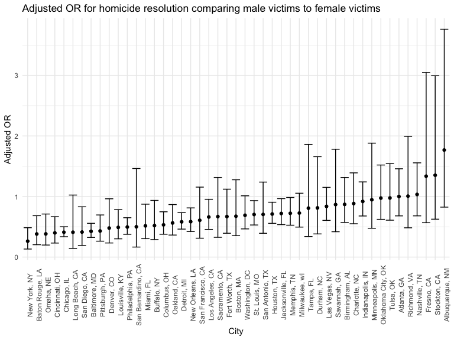

Homework 6
================
Jenesis Merriman
December 3, 2022

## Problem 1

## Problem 2

This problem uses data gathered by the Washington Post on homicides in
50 large U.S. cities.

Create a city_state variable (e.g. “Baltimore, MD”), and a binary
variable indicating whether the homicide is solved. Omit cities Dallas,
TX; Phoenix, AZ; and Kansas City, MO – these don’t report victim race.
Also omit Tulsa, AL – this is a data entry mistake. For this problem,
limit your analysis those for whom victim_race is white or black. Be
sure that victim_age is numeric.

``` r
homicides_hw6 =
  read_csv("./data/homicide-data.csv") %>% #load data
  janitor::clean_names() %>% #clean names
  mutate(city_state = as.factor(str_c(city, state, sep = ", ")), #new variable
         solved = as.logical(ifelse(disposition %in% c("Closed by arrest"), TRUE, FALSE)), #new variable
         reported_date = as.Date(as.character(reported_date),"%Y%m%d"), #fixes date format
         victim_age = as.numeric(victim_age), #character to double
         victim_first = str_to_title(victim_first), #fixes all caps
         victim_last = str_to_title(victim_last), #fixes all caps
         victim_sex = as.factor(victim_sex), #character to factor
         victim_race = as.factor(victim_race), #character to factor
         city = as.factor(city), #character to factor
         state = as.factor(state)) %>% #character to factor
  filter(city_state != "Dallas, TX" & city_state != "Phoenix, AZ" & city_state != "Kansas City, MO" & city_state != "Tulsa, AL") %>%
  filter(victim_race == "White" | victim_race == "Black")
```

    ## Rows: 52179 Columns: 12
    ## ── Column specification ────────────────────────────────────────────────────────
    ## Delimiter: ","
    ## chr (9): uid, victim_last, victim_first, victim_race, victim_age, victim_sex...
    ## dbl (3): reported_date, lat, lon
    ## 
    ## ℹ Use `spec()` to retrieve the full column specification for this data.
    ## ℹ Specify the column types or set `show_col_types = FALSE` to quiet this message.

For the city of Baltimore, MD, use the glm function to fit a logistic
regression with resolved vs unresolved as the outcome and victim age,
sex and race as predictors.

``` r
baltimore =
  homicides_hw6 %>%
  filter(city_state == "Baltimore, MD")

fit = glm(solved ~ victim_age + victim_sex + victim_race, data = baltimore, family = "binomial")
```

Save the output of glm as an R object; apply the broom::tidy to this
object; and obtain the estimate and confidence interval of the adjusted
odds ratio for solving homicides comparing male victims to female
victims keeping all other variables fixed.

``` r
fit %>% 
  tidy(exponentiate = TRUE, conf.int = TRUE, conf.level = 0.95) %>%
  filter(term == "victim_sexMale") %>%
  select(term, "adjusted_OR" = "estimate", "CI_lower" = "conf.low", "CI_upper" = "conf.high")
```

    ## # A tibble: 1 × 4
    ##   term           adjusted_OR CI_lower CI_upper
    ##   <chr>                <dbl>    <dbl>    <dbl>
    ## 1 victim_sexMale       0.426    0.324    0.558

Now run glm for each of the cities in your dataset, and extract the
adjusted odds ratio (and CI) for solving homicides comparing male
victims to female victims. Do this within a “tidy” pipeline, making use
of purrr::map, list columns, and unnest as necessary to create a
dataframe with estimated ORs and CIs for each city.

``` r
city_glm = #investigate error message
  homicides_hw6 %>% 
  nest(data = -city_state) %>% 
  mutate(
    models = map(data, ~glm(solved ~ victim_age + victim_sex + victim_race, family = "binomial", data = .x)),
    exp_results = map(models, tidy, exponentiate = TRUE, conf.int = TRUE, conf.level = 0.95)) %>%
  select(-data, -models) %>% 
  unnest(exp_results) %>%
  filter(term == "victim_sexMale") %>%
  select(city_state, 
         term, 
         "adjusted_OR" = "estimate", 
         "CI_lower" = "conf.low",
         "CI_upper" = "conf.high")
city_glm
```

    ## # A tibble: 47 × 5
    ##    city_state      term           adjusted_OR CI_lower CI_upper
    ##    <fct>           <chr>                <dbl>    <dbl>    <dbl>
    ##  1 Albuquerque, NM victim_sexMale       1.77     0.825    3.76 
    ##  2 Atlanta, GA     victim_sexMale       1.00     0.680    1.46 
    ##  3 Baltimore, MD   victim_sexMale       0.426    0.324    0.558
    ##  4 Baton Rouge, LA victim_sexMale       0.381    0.204    0.684
    ##  5 Birmingham, AL  victim_sexMale       0.870    0.571    1.31 
    ##  6 Boston, MA      victim_sexMale       0.674    0.353    1.28 
    ##  7 Buffalo, NY     victim_sexMale       0.521    0.288    0.936
    ##  8 Charlotte, NC   victim_sexMale       0.884    0.551    1.39 
    ##  9 Chicago, IL     victim_sexMale       0.410    0.336    0.501
    ## 10 Cincinnati, OH  victim_sexMale       0.400    0.231    0.667
    ## # … with 37 more rows

Create a plot that shows the estimated ORs and CIs for each city.
Organize cities according to estimated OR, and comment on the plot.

``` r
city_glm %>%
  ggplot(aes(x = reorder(city_state, +adjusted_OR), y = adjusted_OR)) +
  geom_point(show.legend = FALSE) +
  geom_errorbar(aes(ymin = CI_lower, ymax = CI_upper)) +
  theme(axis.text.x = element_text(angle = 90)) +
  labs(
    title = "Adjusted OR for homicide resolution comparing male victims to female victims",
    x = "City",
    y = "Adjusted OR")
```


\## Problem 3

In this problem, you will analyze data gathered to understand the
effects of several variables on a child’s birthweight. This dataset,
available here, consists of roughly 4000 children.

Load and clean the data for regression analysis (i.e. convert numeric to
factor where appropriate, check for missing data, etc.).

Propose a regression model for birthweight. This model may be based on a
hypothesized structure for the factors that underly birthweight, on a
data-driven model-building process, or a combination of the two.
Describe your modeling process and show a plot of model residuals
against fitted values – use add_predictions and add_residuals in making
this plot.

Compare your model to two others:

One using length at birth and gestational age as predictors (main
effects only) One using head circumference, length, sex, and all
interactions (including the three-way interaction) between these Make
this comparison in terms of the cross-validated prediction error; use
crossv_mc and functions in purrr as appropriate.

Note that although we expect your model to be reasonable, model building
itself is not a main idea of the course and we don’t necessarily expect
your model to be “optimal”.
