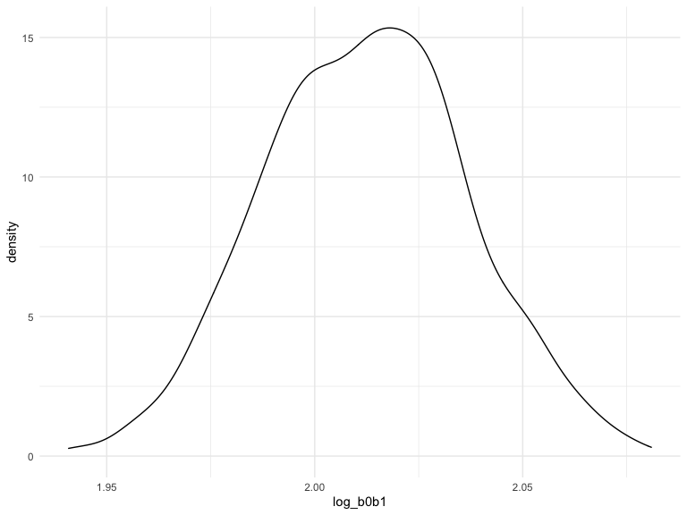

Homework 6
================
Jenesis Merriman
December 3, 2022

## Problem 1

This problem uses 2017 Central Park weather data and solutions from the
course website.

### Data

The code chunk below will download the data:

``` r
weather_df = 
  rnoaa::meteo_pull_monitors(
    c("USW00094728"),
    var = c("PRCP", "TMIN", "TMAX"), 
    date_min = "2017-01-01",
    date_max = "2017-12-31") %>%
  mutate(
    name = recode(id, USW00094728 = "CentralPark_NY"),
    tmin = tmin / 10,
    tmax = tmax / 10) %>%
  select(name, id, everything())
```

    ## Registered S3 method overwritten by 'hoardr':
    ##   method           from
    ##   print.cache_info httr

    ## using cached file: ~/Library/Caches/R/noaa_ghcnd/USW00094728.dly

    ## date created (size, mb): 2022-10-01 14:35:33 (8.406)

    ## file min/max dates: 1869-01-01 / 2022-09-30

### Bootstrapping

To obtain a distribution for $\hat{r}^2$, we will draw bootstrap
samples, apply a model to each, extract the value of initerest, and
summarize. Here, we’ll use `modelr::bootstrap` to draw the samples and
`glance` to produce `r.squared` values.

``` r
weather_df %>% 
  bootstrap(n = 1000) %>% 
  mutate(
    models = map(strap, ~lm(tmax ~ tmin, data = .x) ),
    results = map(models, glance)) %>% 
  select(-strap, -models) %>% 
  unnest(results) %>% 
  ggplot(aes(x = r.squared)) + geom_density()
```


In this example, the $\hat{r}^2$ value is high, and the upper bound at 1
may be a cause for the generally skewed shape of the distribution. If we
wanted to construct a confidence interval for $R^2$, we could take the
2.5% and 97.5% quantiles of the estimates across bootstrap samples.
However, because the shape isn’t symmetric, using the mean +/- 1.96
times the standard error probably wouldn’t work well.

We can produce a distribution for $\log(\beta_0 * \beta1)$ using a
similar approach, with a bit more wrangling before we make our plot.

``` r
weather_df %>% 
  bootstrap(n = 1000) %>% 
  mutate(
    models = map(strap, ~lm(tmax ~ tmin, data = .x) ),
    results = map(models, broom::tidy)) %>% 
  select(-strap, -models) %>% 
  unnest(results) %>% 
  select(id = `.id`, term, estimate) %>% 
  pivot_wider(
    names_from = term, 
    values_from = estimate) %>% 
  rename(beta0 = `(Intercept)`, beta1 = tmin) %>% 
  mutate(log_b0b1 = log(beta0 * beta1)) %>% 
  ggplot(aes(x = log_b0b1)) + geom_density()
```



As with $\hat{r}^2$, this distribution is somewhat skewed and has some
outliers.

## Problem 2

This problem uses data gathered by the Washington Post on homicides in
50 large U.S. cities.

### Data

First, I will load and tidy the data.

The following code uses `mutate` to update variables to appropriate
types, convert reported_date into a more readable format (YYY-MM-DD),
and correct the capitalization of victim_first and victim_last. It also
creates two new variables: i) a `city_state` variable that returns both
city and state (e.g. “Baltimore, MD”), and ii) a binary variable
`solved` indicating whether the homicide is solved (TRUE) or not
(FALSE). Solved homicides are defined as homicides for which the
disposition is “Closed by arrest.” `filter` is used to omit homicides in
Dallas, TX; Phoenix, AZ; Kansas City, MO; and Tulsa, AL, and to limit
our analysis to homicides for which victim_race is white or Black.

``` r
homicides =
  read_csv("./data/homicide-data.csv") %>% #load data
  janitor::clean_names() %>% #clean names
  mutate(city_state = as.factor(str_c(city, state, sep = ", ")), #new variable
         solved = as.logical(ifelse(disposition %in% c("Closed by arrest"), TRUE, FALSE)), #new variable
         reported_date = as.Date(as.character(reported_date),"%Y%m%d"), #fixes date format
         victim_age = as.numeric(victim_age), #character to double
         victim_first = str_to_title(victim_first), #fixes all caps
         victim_last = str_to_title(victim_last), #fixes all caps
         victim_sex = as.factor(victim_sex), #character to factor
         victim_race = as.factor(victim_race), #character to factor
         city = as.factor(city), #character to factor
         state = as.factor(state)) %>% #character to factor
  filter(city_state != "Dallas, TX" & city_state != "Phoenix, AZ" & city_state != "Kansas City, MO" & city_state != "Tulsa, AL") %>%
  filter(victim_race == "White" | victim_race == "Black")
```

    ## Rows: 52179 Columns: 12
    ## ── Column specification ────────────────────────────────────────────────────────
    ## Delimiter: ","
    ## chr (9): uid, victim_last, victim_first, victim_race, victim_age, victim_sex...
    ## dbl (3): reported_date, lat, lon
    ## 
    ## ℹ Use `spec()` to retrieve the full column specification for this data.
    ## ℹ Specify the column types or set `show_col_types = FALSE` to quiet this message.

### Model

Next, I will use the `glm` function to fit a logistic regression with
solved vs unsolved as the outcome and victim age, sex and race as
predictors for the city of Baltimore, MD.

``` r
baltimore =
  homicides %>%
  filter(city_state == "Baltimore, MD")

fit = glm(solved ~ victim_age + victim_sex + victim_race, data = baltimore, family = "binomial")
```

The following code saves the output of my logistic regression model as
an R object. `tidy` and `filter` are used to obtain the adjusted odds
ratio estimate and confidence interval for solving homicides comparing
male victims to female victims, keeping all other variables fixed.

``` r
fit_output =
  fit %>% 
  tidy(exponentiate = TRUE, conf.int = TRUE, conf.level = 0.95) %>%
  filter(term == "victim_sexMale") %>%
  select(term, "adjusted_OR" = "estimate", "CI_lower" = "conf.low", "CI_upper" = "conf.high")

fit_output
```

    ## # A tibble: 1 × 4
    ##   term           adjusted_OR CI_lower CI_upper
    ##   <chr>                <dbl>    <dbl>    <dbl>
    ## 1 victim_sexMale       0.426    0.324    0.558

Now, I will run `glm` for each of the cities in the homicides dataset,
and extract the adjusted odds ratio and confidence interval for solving
homicides comparing male victims to female victims. The following “tidy”
pipeline uses `purrr::map`, `glm`, `tidy`, list columns, and `unnest` to
create a dataframe with estimated ORs and CIs for each city. `filter`
and `select` are used to select our values of interest.

``` r
city_glm =
  homicides %>% 
  nest(data = -city_state) %>% 
  mutate(
    models = map(data, ~glm(solved ~ victim_age + victim_sex + victim_race, family = "binomial", data = .x)),
    exp_results = map(models, tidy, exponentiate = TRUE, conf.int = TRUE, conf.level = 0.95)) %>%
  select(-data, -models) %>% 
  unnest(exp_results) %>%
  filter(term == "victim_sexMale") %>%
  select(city_state, 
         term, 
         "adjusted_OR" = "estimate", 
         "CI_lower" = "conf.low",
         "CI_upper" = "conf.high")
city_glm
```

    ## # A tibble: 47 × 5
    ##    city_state      term           adjusted_OR CI_lower CI_upper
    ##    <fct>           <chr>                <dbl>    <dbl>    <dbl>
    ##  1 Albuquerque, NM victim_sexMale       1.77     0.825    3.76 
    ##  2 Atlanta, GA     victim_sexMale       1.00     0.680    1.46 
    ##  3 Baltimore, MD   victim_sexMale       0.426    0.324    0.558
    ##  4 Baton Rouge, LA victim_sexMale       0.381    0.204    0.684
    ##  5 Birmingham, AL  victim_sexMale       0.870    0.571    1.31 
    ##  6 Boston, MA      victim_sexMale       0.674    0.353    1.28 
    ##  7 Buffalo, NY     victim_sexMale       0.521    0.288    0.936
    ##  8 Charlotte, NC   victim_sexMale       0.884    0.551    1.39 
    ##  9 Chicago, IL     victim_sexMale       0.410    0.336    0.501
    ## 10 Cincinnati, OH  victim_sexMale       0.400    0.231    0.667
    ## # … with 37 more rows

### Adjusted OR Plot

Finally, the following code uses `geom_point` and `geom_errorbar` to
create a plot showing the estimated adjusted odds ratios and confidence
intervals for each city. Cities are arranged in ascending order of
estimated OR.

``` r
city_glm %>%
  ggplot(aes(x = reorder(city_state, +adjusted_OR), y = adjusted_OR)) +
  geom_point(show.legend = FALSE) +
  geom_errorbar(aes(ymin = CI_lower, ymax = CI_upper)) +
  theme(axis.text.x = element_text(angle = 90)) +
  labs(
    title = "Adjusted OR for homicide resolution comparing male victims to female victims",
    x = "City",
    y = "Adjusted OR")
```


**Comment:** The plot suggests that the odds of homicide resolution for
male victims is less than the odds of homicide resolution for female
victims in most of our analyzed cities, in general, after adjusting for
victim age and race. In other words, after adjusting for victim age and
race, homicides are generally more likely to be solved in cases where
the victim is a woman compared to cases where the victim is a man. This
is true for all cities in our dataset *except* Atlanta, GA; Richmond,
VA; Nashville, TN; Fresno, CA; Stockton, CA; and Albuquerque, NM, where
the adjusted OR \>= 1, indicating that the odds of homicide resolution
for male victims is equal to or greater than the odds of homicide
resolution for female victims in these cities.

## Problem 3

This problem uses data gathered to understand the effects of several
variables on a child’s birthweight. This dataset includes information on
roughly 4000 children.

### Data

First, I will load and clean the data for regression analysis. `mutate`
is used to convert babysex, frace, malform, and mrace from numeric
variables to factor variables. `is.na` and `unique` are used to check
for missing and unusual data.

``` r
birthweight =
  read_csv("./data/birthweight.csv") %>% #load data
  janitor::clean_names() %>%
  mutate(babysex = as.factor(babysex),
         frace = as.factor(frace),
         malform = as.factor(malform),
         mrace = as.factor(mrace))
```

    ## Rows: 4342 Columns: 20
    ## ── Column specification ────────────────────────────────────────────────────────
    ## Delimiter: ","
    ## dbl (20): babysex, bhead, blength, bwt, delwt, fincome, frace, gaweeks, malf...
    ## 
    ## ℹ Use `spec()` to retrieve the full column specification for this data.
    ## ℹ Specify the column types or set `show_col_types = FALSE` to quiet this message.

``` r
colSums(is.na(birthweight)) #check for missing data: none missing
lapply(birthweight, unique) #check for unusual values: menarche = 0, 1 observation
```

No missing data was identified. There is one observation where menarche
= 0, which is unexpected, because our menarche variable represents the
mother’s age at menarche (years). I will make note of this but refrain
from changing the data.

### Model

Next, I will fit a regression model for birthweight using `step` and
`lm` to preform the stepwise model selection procedure by AIC.

``` r
fit_step = step(lm(bwt ~ ., birthweight), direction = "both", trace = FALSE)

tidy(fit_step)
```

    ## # A tibble: 14 × 5
    ##    term         estimate std.error statistic   p.value
    ##    <chr>           <dbl>     <dbl>     <dbl>     <dbl>
    ##  1 (Intercept) -6099.      138.       -44.3  0        
    ##  2 babysex2       28.6       8.45       3.38 7.37e-  4
    ##  3 bhead         131.        3.45      37.9  3.10e-272
    ##  4 blength        74.9       2.02      37.1  4.29e-262
    ##  5 delwt           4.11      0.392     10.5  2.26e- 25
    ##  6 fincome         0.318     0.175      1.82 6.88e-  2
    ##  7 gaweeks        11.6       1.46       7.93 2.79e- 15
    ##  8 mheight         6.59      1.78       3.69 2.23e-  4
    ##  9 mrace2       -139.        9.91     -14.0  1.21e- 43
    ## 10 mrace3        -74.9      42.3       -1.77 7.68e-  2
    ## 11 mrace4       -101.       19.3       -5.21 1.98e-  7
    ## 12 parity         96.3      40.3        2.39 1.70e-  2
    ## 13 ppwt           -2.68      0.427     -6.26 4.20e- 10
    ## 14 smoken         -4.84      0.586     -8.27 1.75e- 16

This model was selected using stepwise selection by AIC, a data-driven
model-building process. Stepwise selection is a combination of forward
and backwards model selection, during which variables are removed from
and entered into the model in a way that leads to the best improvement
in AIC (smallest AIC). The resulting model is bwt \~ babysex + bhead +
blength + delwt + fincome + gaweeks + , mheight + mrace + parity +
ppwt + smoken.

### Residuals vs Fits Plot

The following code uses `add_predictions` and `add_residuals` to create
a plot of model residuals against fitted values.

``` r
birthweight %>%
  add_residuals(fit_step) %>%
  add_predictions(fit_step) %>%
  ggplot(aes(x = pred, y = resid)) + 
  geom_point() +
  geom_hline(yintercept = 0,linetype = "dashed")
```


``` r
#plot(fit_step) used to verify
```

### Model Comparison

Finally, I will compare my selected fit_step model to two other models:

- fit_i using length at birth and gestational age as predictors
- fit_ii using head circumference, length, sex, and all interactions
  between these

``` r
fit_i = lm(bwt ~ blength + gaweeks, data = birthweight)
fit_ii = lm(bwt ~ bhead + blength + babysex + bhead * blength * babysex, data = birthweight)

tidy(fit_i)
```

    ## # A tibble: 3 × 5
    ##   term        estimate std.error statistic  p.value
    ##   <chr>          <dbl>     <dbl>     <dbl>    <dbl>
    ## 1 (Intercept)  -4348.      98.0      -44.4 0       
    ## 2 blength        129.       1.99      64.6 0       
    ## 3 gaweeks         27.0      1.72      15.7 2.36e-54

``` r
tidy(fit_ii)
```

    ## # A tibble: 8 × 5
    ##   term                    estimate std.error statistic      p.value
    ##   <chr>                      <dbl>     <dbl>     <dbl>        <dbl>
    ## 1 (Intercept)            -7177.     1265.       -5.67  0.0000000149
    ## 2 bhead                    182.       38.1       4.78  0.00000184  
    ## 3 blength                  102.       26.2       3.90  0.0000992   
    ## 4 babysex2                6375.     1678.        3.80  0.000147    
    ## 5 bhead:blength             -0.554     0.780    -0.710 0.478       
    ## 6 bhead:babysex2          -198.       51.1      -3.88  0.000105    
    ## 7 blength:babysex2        -124.       35.1      -3.52  0.000429    
    ## 8 bhead:blength:babysex2     3.88      1.06      3.67  0.000245

The following code uses `crossv_mc`, `mutate`, and `map` functions in
`purrr` to compare the cross-validated prediction errors of fit_step,
fit_i, and fit_ii. It does so by generating training and testing
datasets, fitting the three models to assess prediction accuracy, and
obtaining RMSEs for each model.

``` r
cv_df = 
  crossv_mc(birthweight, 100) %>% 
  mutate(
    train = map(train, as_tibble),
    test = map(test, as_tibble),
  )

cv_df = 
  cv_df %>% 
  mutate(
    step_fits = map(.x = train, ~lm(bwt ~ babysex + bhead + blength + delwt + fincome + 
                gaweeks + mheight + mrace + parity + ppwt + smoken, data = .x)),
    i_fits =  map(.x = train, ~lm(bwt ~ blength + gaweeks, data = .x)),
    ii_fits = map(.x = train, ~lm(bwt ~ bhead + blength + babysex + bhead * blength * babysex, data = .x))
  ) %>% 
  mutate(
    rmse_step = map2_dbl(.x = step_fits, .y = test, ~rmse(model = .x, data = .y)),
    rmse_i =    map2_dbl(.x = i_fits,    .y = test, ~rmse(model = .x, data = .y)),
    rmse_ii = map2_dbl(.x = ii_fits, .y = test, ~rmse(model = .x, data = .y))
  )
```

The following code creates a plot showing the distribution of RMSE
values for each model:

``` r
cv_df %>% 
  select(starts_with("rmse")) %>% 
  pivot_longer(
    everything(),
    names_to = "model",
    values_to = "rmse",
    names_prefix = "rmse_"
  ) %>% 
  ggplot(aes(x = model, y = rmse)) +
  geom_boxplot()
```


*Comment:* Based on this plot, the fit_step model is the best fit for
our data. Compared to the other two models, fit_step has the lowest RMSE
values, on average.
